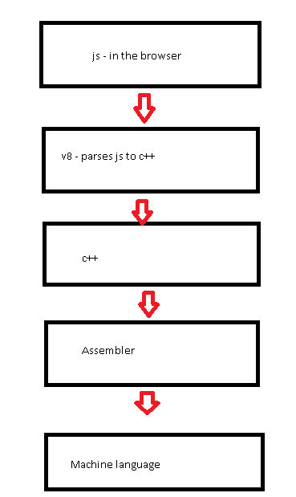
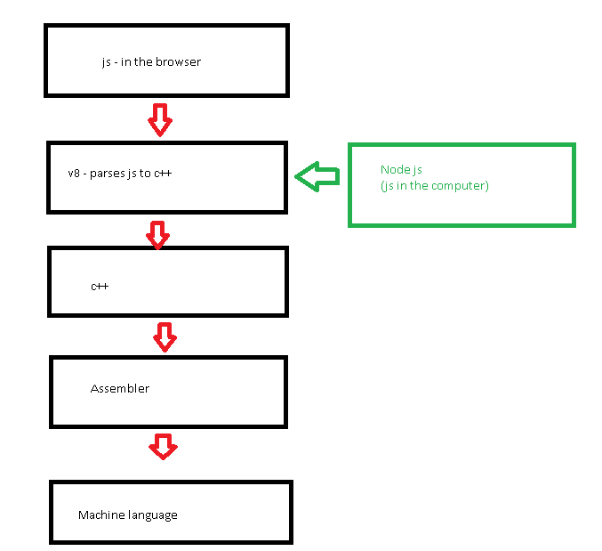
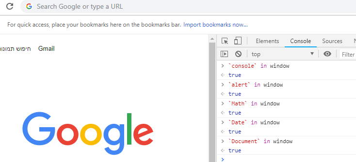
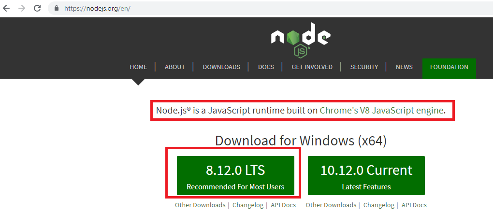
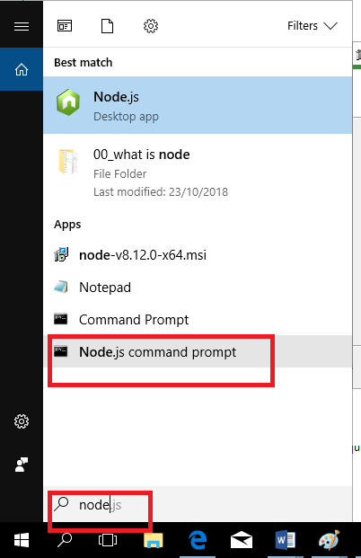
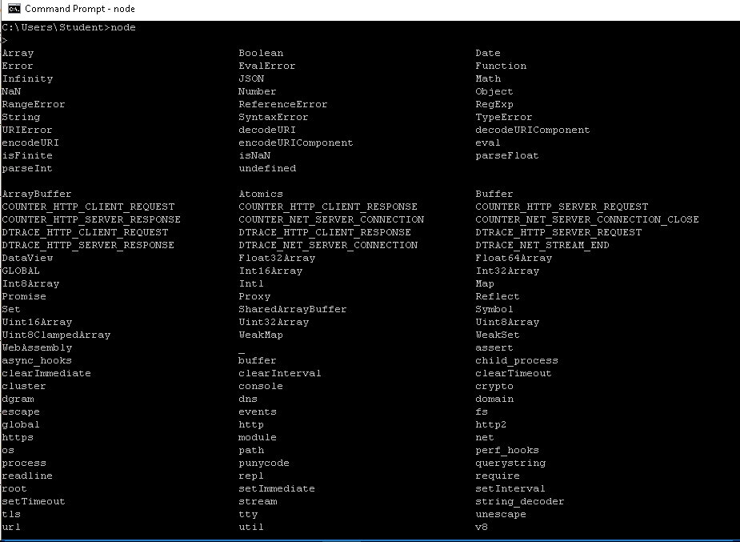

## What is a browser application?
An app that can parse this technologies:
* HTML
* CSS
* JS   

The app gets the content from a server (with a http request) and shows it with GUI 

## How `browser js` runs in the computer?
* Js runs in the cpu as a machine language
* Every browser parses js to machine language in a different way
* For example: Chrome uses `v8`   



## What is node?


## Js in the browse has the `window` as a main object


## Js in the computer (node) has the `GLOBAL` as a main object
* First go to the webpage of node to download `node`:   

* After running node in tha computer, open the node cli:   

* Write this commands in the cli , (this will show all the properties of the `GLOBAL` object):




# Npm
npm = npm is the `node package manager` for JavaScript.


#### Options to install npm packages:
* `Global` - one download for the current user (after we install from npm - we can access this package from any cli in our computer)

<br/>
Syntax to install global from npm:
```
npm install -g <PACKAGE-NAME>
```
For example:
<br/>


* Per project 
<br/>
Syntax to install local from npm:
```
npm install -s <PACKAGE-NAME>
```